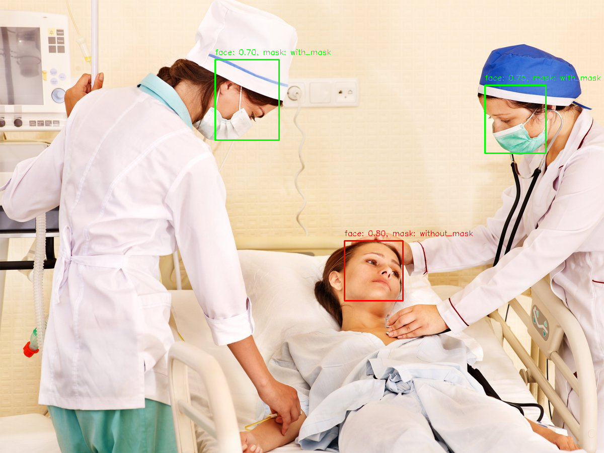

# Распознавание наличия масок на лицах

Идея модели в том, чтобы используя предобученную YOLO детектировать лица на фотографии, после чего с помощью
написанной на Torch CNN определять наличие/отсутствие/неправильность маски на лицах находящихся на фотографии людей.
    
Первой итерацией программы было определение наличия/отсутствия маски на лице с помощью cv2.inRange для белого цвета.
Критерием было заполнение белым 1/4 части пикселей прямоугольника лица.

Дальше решил с помощью PyTorch написать ручками CNN. Можно было попробовать использовать ResNet, MobileNet,
но раз уж начал писать pet-проект, сложно остановиться

Accuracy на валидационной выборке для классификации наличия маски на лице добивает 98%.

Модель справляется с задачей нахождения лиц на фотографии и определения наличия масок на них.  
Делает это даже для лиц в масках, сильно повернутых. 

## Структура проекта
'''
MaskRecognition/  
├── data/                  # Папка с данными  
│   ├────train/            # Тренировочный датасет для классификатора масок на лицах (Я его не заливал по понятным причинам.)  
│   │      ├─── mask_weared_incorrect/  
│   │      ├─── with_mask/  
│   │      ├─── without_mask/  
│   │        
│   └──── val/             # Валидационный датасет  
│          ├─── ...        # Структура аналогична ./data/train  
│  
├── models/                # Здесь лежат pt/pth файлы с обученными моделями (YOLO, MaskClassifier)   
├── src/                   # Папка с исходным кодом  
│   ├────detection/        # Исходники для детекции лиц на фото (Импорт YOLO)  
│   ├────classificattion/  # Исходники для классификации наличия масок (CNN на PyTorch)  
│   ├────dataloader/       # Исходники для загрузки датасета  
├── test/                  # Тестирование работоспособности модулей (Типа юнит тесты)  
├── requirements.txt       # Список требуемых библиотек  
├── config/constants.py    # Вынесенные константы  
└── README.md              # Документация  
'''

### Датасеты
- face roi для классификации: https://www.kaggle.com/datasets/vijaykumar1799/face-mask-detection
- Думаю попробовать https://www.kaggle.com/datasets/andrewmvd/face-mask-detection 

### Пример результата работы программы:
 
